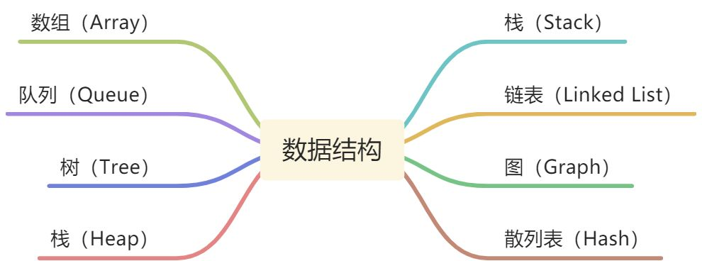

# 一、什么是数据结构？

## 1.1 什么是数据结构与算法？

希望了解编程语言的设计层面

### 1.1.1 什么是数据结构？

数据结构就是在计算机中存储和组织数据的方式 解决问题方法的效率，跟数据的组织方式有关

### 1.1.2常见的数据结构有哪些？

- 每一种都有对应的应用场景，不同的数据结构的不同操作性能是不同的
- 有的查询性能很快，有的插入性能很快，有的是插入头和尾速度很快
- 有的做范围查找很快，有的允许元素重复，有的不允许重复等等
- 在开发中如何选择，要根据具体的需求来选择
> ❗注意：数据结构和语言无关，常见的编程语言都有直接或间接的使用上述常见的的数据结构

## 1.2 什么是算法？

### 1.2.1 算法（`algorithm`）的认识

- 算法：`Algorithm`
- 不同的算法，执行效率是不一样的
- 在解决问题的过程中，不仅仅数据的存储方式会影响效率，算法的优劣也会影响着效率

### 1.2.2 算法的定义

- 一个有限指令集，每条指令的描述不依赖于语言
- 接受一些输入
- 产生输出
- 一定在有限步骤之后终止

### 1.2.3 算法通俗理解

Algorithm这个单词本意就是解决问题的办法／步骤／逻辑 数据结构的实现，离不开算法

## 1.3 生活中的数据结构

### 1.3.1 图书的摆放

为了更加方便的插入和搜索书籍，需要合理的组织数据，并且通过更加高效的算法插入和查询数据

### 1.3.2 快递员的快递

将快递的取件码以A－Z的方式排序，或者以xx－xx－xx的方式排序