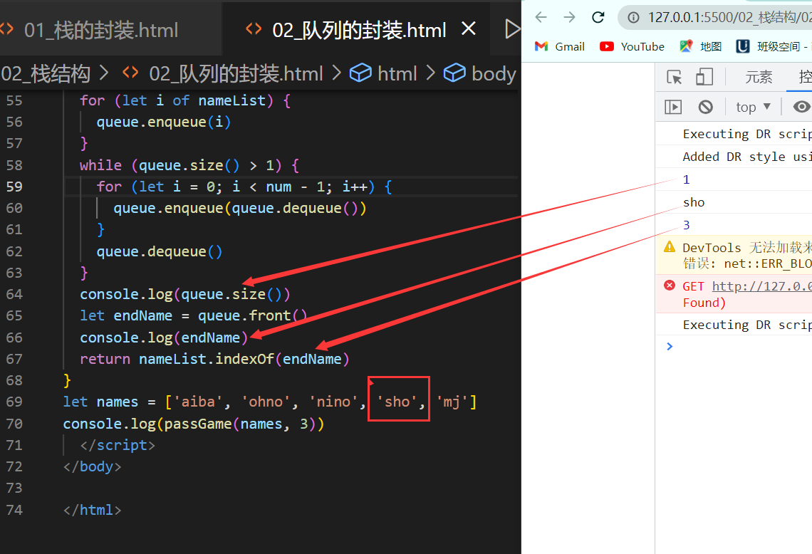

# 二、线性结构

## 2.1 数组`Array`

常见api：

- `push()`
- `unshift()`
- `shift()`
- `pop()`
- `concat()`
- `reverse()`
- `sort()`
- `join()`
- `indexOf()`
- `splice(index,num)`
- `splice(index,num,val)`

## 2.2 栈`Stack`

### 2.2.1 认识栈结构

- 栈也是一种非常常见的数据结构，并且在程序中的应用非常广泛
- 数组
   - 我们知道数组是一种线性结构，并且可以在数组的任意位置插入和删除数据
   - 但是有时候，我们为了实现某些功能，必须对这种任意性加以限制
   - 而栈和队列就是比较常见的受限的线性结构
- 栈（stack），它是一种受限的线性表，后进先出（LIFO：last in first out）
   - 其限制是仅允许在表的一端进行插入和删除运算。这一端被称为栈顶，另一端称为栈底。
   - LIFO表示就是后进入的元素，第一个弹出栈空间。
   - 向一个栈插入新元素又称作进栈、入栈或压栈，它是把新元素放到栈顶元素的上面，使之成为新的栈顶元素。
   - 从一个栈删除元素又称作出栈或退栈，它是把栈顶元素删除掉，使其相邻的元素成为新的栈顶元素。
- 生活中类似栈的
   - 收到的邮件
   - 自助餐的餐盘
- 程序中的栈结构
   - 函数调用栈   
      - A( B( C( D() ) ) )：即A函数中调用B，B调用C，C调用D
> 在A执行的过程中，A会被压入栈；随后B执行时，B被压入栈；C、D执行时也依次被压入栈 .
> 所以当前栈的顺序为：A（栈底）->B->C->D（栈顶）.
> 当函数D执行完后，会弹出栈被释放，弹出栈的顺序为：D->C->B->A .

   - 递归
> 为什么没有停止条件的递归会导致栈溢出？  
> 比如函数A为递归函数，不断的调用自己（因为函数还没有执行完，不会函数弹出栈），不停的把相同的的函数A压入栈，最后造成**栈溢出**(Stack Overfloat)

   - 练习，有6个元素6,5,4,3,2,1按顺序进栈，问下列哪个不是合法的出栈顺序？
      - A：5 4 3 6 1 2
      - B：4 5 3 2 1 6
      - C：3 4 6 5 2 1
      - D：2 3 4 1 5 6
> 正确答案：C  
> A：6 5进栈，5出栈，4进栈出栈，3进栈出栈，6出栈，2 1进栈，1 2出栈    
> B：6 5 4 进栈，4 5出栈，3进栈出栈，2进栈出栈，1进栈出栈，6出栈    
> D：6 5 4 3 2进栈，2 3 4出栈，1进栈出栈，5 6出栈    

### 2.2.2 栈结构封装

基于数组实现
```javascript
//封装栈类
function Stack(){
  //栈中的属性
  this.items = []
  //栈的相关操作
  //1.将元素压入栈
  //this.push = function(){
  //}
  Stack.prototype.push = (element) => {
    this.items.push(element)
  }
  //2.从栈中取出元素
  Stack.prototype.pop = () => {
    return this.items.pop()
  }  
  //3.查看栈顶元素
  Stack.prototype.peek = () => {
    return this.items[this.items.length - 1]
  }
  //4.判断栈是否为空
  Stack.prototype.isEmpty = () => {
    return this.items.length == 0
  }
  //5.获取栈中元素的个数
  Stack.prototype.Size = () => {
    return this.items.length
  }
  //6.toString方法
  Stack.prototype.toString = () => {
    return this.items.join('')
  }
}
//栈的使用
let s = new Stack()
s.push(4)
s.puhs(18)
s.push(6)
s.push(17)
s.pop()
s.peek()
s.Size()
s.isEmpty()
s.toString()
```
基于链表实现

### 2.2.3 栈常见的操作

- `push(element)`：添加一个元素到栈顶位置
- `pop()`：移除栈顶的元素，同时返回被移除的元素
- `peek()`：返回栈顶的元素，不对栈做任何修改
- `isEmpty()`：若为空，则返回true；否则，返回false
- `size()`：返回栈里的元素个数
- `toString()`：将栈的内容以字符形式返回

### 2.2.4 栈结构的简单封装

利用栈结构的特点封装十进制转二进制的函数
```javascript
//函数：将十进制转为二进制
function dec2bin(decNumber) {
  let stack = new Stack()
  while(decNumber > 0){
    stack.push(decNumber % 2)
    decNumber = Math.floor(decNumber / 2) 
  }
  let binaryStr = ''
  while(!stack.isEmpty()){
    binaryStr += stack.pop()
  }  
  return binaryStr
}
```

## 2.3 队列`Queue`

### 2.3.1 认识队列

- 队列(Queue)，它是一种受限的线性表，先进先出 (FIFO: First In First Out )
   - 受限之处在于它只允许在表的前端（front）进行删除操作
   - 在表的后端（rear）进行插入操作
- 生活中类似的队列结构
   - 排队买票，买饭，上厕所
   - 优先排队的人，优先处理

### 2.3.2 队列的应用

打印队列：计算机打印多个文件时，需要排队打印<br />线程队列：当开启多线程时，若新开启的线程，所需要的资源不足时，就先放入线程队列，等待CPU处理
### 2.3.3 队列类的实现

队列类的实现和栈一样，有两种方案：<br />基于数组实现
```javascript
//封装队列类
function Queue() {
  //属性
  this.items = []
  //方法
  //1.enqueue
  Queue.prototype.enqueue = (element) => {
    this.items.push(element)
  }
  //2.dequeue
  Queue.prototype.dequeue = () => {
    return this.items.shift()
  }
  //3.front
  Queue.prototype.front = () => {
    return this.items[0]
  }
  //4.isEmpty
  Queue.prototype.isEmpty = () => {
    return this.items.length === 0
  }
  //5.size
  Queue.prototype.size = () => {
    return this.items.length
  }
  //6.toString
  Queue.prototype.toString = () => {
    return this.items.join('')
  }
}
let queue = new Queue()
queue.enqueue(4);
queue.enqueue(18);
queue.enqueue(6);
queue.enqueue(17);
queue.dequeue();
queue.front();
queue.isEmpty();
queue.size();
queue.toString();
```
基于链表实现
### 
### 2.3.4 队列常见的操作

- `enqueue(element)`:向队列尾部添加一个（或多个）新的项.
- `dequeue()`:移除队列的第一（即排在队列最前面的）项，并返回被移除的元素.
- `front()`:返回队列中的一个元素（最先被添加，也将是最先被移除的元素），队列不做任何变动（不移除元素，只返回元素信息，与Stack的peek()方法类似）.
- `isEmpty()`:若队列为空，返回true，否则，返回false.
- `size()`:返回队列包含的元素个数.
- `toString()`:将队列中的内容，转为字符串形式.
### 
### 2.3.5 队列的应用

> 使用队列实现小游戏：击鼓传花，传入一组数据和设定的的数字num，循环遍历数组内元素，遍历到的元素为制定数字num时将该元素删除，直至数组剩下一个元素。
> (从第一个人开始，按顺序数1,2,3----num，数到num的那个人淘汰，从被淘汰的下一个人再开始按顺序数1,2,3---num，以此类推，求最后剩下的那个人的名字，及在数组中的位置下标)

代码实现：
```javascript
let passGame = (nameList, num) => {
  let queue = new Queue()
  for (let i of nameList) {
    queue.enqueue(i)
  }
  while (queue.size() > 1) {
    for (let i = 0; i < num-1; i++) {
      queue.enqueue(queue.dequeue())
    }
    queue.dequeue()
  }
  console.log(queue.size())
  let endName = queue.front()
  console.log(endName)
  return nameList.indexOf(endName)
}
let names = ['aiba', 'ohno', 'nino', 'sho', 'mj']
console.log(passGame(names, 3))
```
结果展示<br />
### 
### 2.3.6 优先队列

优先队列主要考虑的问题为：

- 每个元素不再只是一个数据，还包含数据的优先级
- 在添加数据过程中，根据优先级放入到正确位置

#### 2.3.6.1 优先级队列的实现

代码实现：
```javascript
//封装优先级队列
function PriorityQueue() {
  //内部类，在类里面再封装一个类，表示带优先级的数据
  function QueueElement(element, priority) {
    this.element = element
    this.priority = priority
  }
  //封装属性
  this.items = []
  //1.实现按照优先级插入方法
  PriorityQueue.prototype.enqueue = (element, priority) => {
    let queueElement = new QueueElement(element, priority)
    if (this.items.length === 0) {
      this.items.push(queueElement)
    } else {
      let added = false
      for (let i of this.items) {
        if (queueElement.priority < i.priority) {
          this.items.splice(i, 0, queueElement)
          added = true
          break
        }
      }
      if (!added) {
        this.items.push(queueElement)
      }
    }
  }
  //2.dequeue:删除队列前端的元素
  PriorityQueue.prototype.dequeue = () => {
    return this.items.shift()
  }
  //3.front:查看前端的元素
  PriorityQueue.prototype.front = () => {
    return this.items[0]
  }
  //4:isEmpty:查看队列元素是否为空
  PriorityQueue.prototype.isEmpty = () => {
    return this.items.legth === 0
  }
  //5.size:查看队列中元素的个数
  PriorityQueue.prototype.size = () => {
    return this.items.length
  }
  //6.toString:以字符串形式输出队列中的元素
  PriorityQueue.prototype.toString = () => {
    let resultString = ''
    for (let i of this.items) {
      resultString += i.element + '-' + i.priority + ''
    }
    return resultString
  }
}
//测试代码
let pq = new PriorityQueue()
pq.enqueue('nino', 617)
pq.enqueue('ren', 418)
pq.enqueue('money', 999)
console.log(pq)
```
测试结果<br />

#### 2.3.6.2 注意点

- 关于数组splice方法
   - `splice(1,0,'nino')`：表示在索引为1的位置，删除0个元素，插入一个"nino"元素
   - `splice(1,1,'nino')`：表示在索引为1的位置，删除1个元素，插入一个"nino"元素
- 数组的push方法在数组、栈和队列中的表现形式
   - 数组：在数组［0,1,2］中，执行push（3），结果为［0,1,2,3］
   - 栈：stack.push()方法，执行push（0），push（1），push（2），其数组的顺序为［0,1,2］，但是索引为2的元素其实是栈顶元素；所以栈的push方法是向栈顶添加元素（但在数组的视角下，为向数组尾部添加元素）
   - 队列：queue.enqueue()方法，其实是由数组的push()方法实现，相当于在数组头部增加元素

## 2.4 链表`Linked List`
